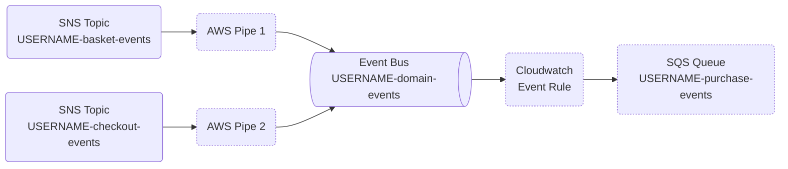

# Senior PRE Technical Task

- [Introduction](#introduction)
- [Assistance / Support](#assistance--support)
- [Instructions](#instructions)
- [Technical Task](#technical-task)
  - [Implement EventBridge pipes \& rules](#implement-eventbridge-pipes--rules)
- [AWS Resources provided](#aws-resources-provided)
  - [Setting up your environment](#setting-up-your-environment)
  - [Your IAM User \& permissions](#your-iam-user--permissions)
  - [Testing your implementation](#testing-your-implementation)
  - [Troubleshooting \& Advice](#troubleshooting--advice)
- [Helper scripts](#helper-scripts)
  - [send-mock-events.sh](#send-mock-eventssh)
  - [watch-sqs-queue.sh](#watch-sqs-queuesh)
  - [watch-logs-group.sh](#watch-logs-groupsh)

## Introduction

The goal of this exercise is to demonstrate your ability to write infrastructure as-code, to configure a serverless event bus to receive and route messages. This is directly inspired from a work we did recently for one of our development team.

We chose this as our technical task as it was reasonably quick to implement but required us to work with IAM roles, IAM resource policies (for SQS queues) and Cloudwatch logs/metrics for troubleshooting.

## Assistance / Support

Should you have any questions or find yourself blocked, you can get in touch directly with me via Amazon Chime. I am available to answer any technical questions or help with any problems you encounter.

To get in touch with me, you can either [install the client for your operating system][client] or [use the web application][webapp] to access Amazon Chime. Once authenticated with your personal account, send your messages to gregorybecker@notonthehighstreet.com to begin a conversation with myself.

Alternatively, you can contact me by email which I tend to check once per day.

[client]: https://aws.amazon.com/chime/download-chime
[webapp]: https://app.chime.aws

## Instructions

1. Clone this repository
2. Implement your solution using Terraform
3. Use the AWS credentials we provided to plan & apply your changes into our AWS account
   1. Deploy your changes in the region `eu-west-1`
   2. Always prefix the name of your resources with your username (eg. `USERNAME-something` or `/USERNAME/something` for AWS LogGroups)
4. Keep the resources provisioned and provide us a link to a Git public repository with your final solution

⏱️ Your solution must be provided within 3 working days of receipt of this test.

**Helpful tips**

* This README contains some useful information that can help you if you're stuck.
* Do not overthink your solution; keep it reasonable simple.
* If you struggle completing the test, explain what you couldn't get working and the steps you took to solve them problem. Whilst we want to see completed tests it is just as important for us to see how you approached an issue and attempted to find a solution.

## Technical Task

### Implement EventBridge pipes & rules

Using [Amazon EventBridge pipes][docs], your task will be to receive & send messages published to existing SNS topics into an event bus. Then, to create an event rule that will match events sent to either topic and send them to a SQS queue that you are asked to provision.

[docs]: https://docs.aws.amazon.com/eventbridge/latest/userguide/eb-what-is.html

Here is a diagram of the resources we are asking you to implement. The resources with a dotted border are missing and for you to provision with Terraform.



## AWS Resources provided

To help you, we have already provisioned a set of AWS resources into one of our AWS account. This AWS account (ID 536697261635) has been created specifically for this exercise. As this account is shared with other candidates, make sure you read the section below detailing the IAM permissions you have been granted and how to name your resources.

| Resource type        | ARN                                                                           |
|----------------------|-------------------------------------------------------------------------------|
| SNS topic            | arn:aws:sns:eu-west-1:536697261635:USERNAME-basket-events              |
| SNS topic            | arn:aws:sns:eu-west-1:536697261635:USERNAME-checkout-events           |
| Cloudwatch Event Bus | arn:aws:events:eu-west-1:536697261635:event-bus/USERNAME-domain-events |
| IAM User             | arn:aws:iam::536697261635:user/USERNAME                                |

🔑 You can access this AWS account using the login credentials we have shared with you via 1password.
Please refer to our email to find a link to access your credentials.

### Setting up your environment

Your first step will be to setup your local environment and to configure the credentials of the IAM user we provided, to allow you to develop and deploy a Terraform stack from our local environment.

ℹ️ We kindly asked that you keep using **S3 as backend** to allow us to plan, apply and destroy your stack at the end of your interview.
We have provided all the details to configure your backend in `backend.tf.dist`.

### Your IAM User & permissions

Your IAM user should have all the necessary IAM policies to complete this task provided that you **prefix the resources you create with the username of your IAM user** (e.g. *hello-world-purchase-events-processor*). Otherwise Terraform will fail to plan or apply your changes as the IAM policies assigned to your IAM user only grant access to AWS resources prefixed with `USERNAME-` or `/USERNAME/` for LogGroups.

You may find however that your IAM user is lacking an AWS access key which you will most likely need to configure your AWS CLI and assume this user with Terraform. That's for you to do.

As mentioned previously, please refer to our email to find a link to access your credentials.

### Testing your implementation

Within this repository, you will find a set of JSON files that can be used to send test events from the SNS topics we provided.

```sh
aws sns publish \
  --topic-arn arn:aws:sns:eu-west-1:536697261635:${IAM_USERNAME}-basket-events \
  --message file://example-sns-events/basket-updated-event.json

aws sns publish \
  --topic-arn arn:aws:sns:eu-west-1:536697261635:${IAM_USERNAME}-checkout-events \
  --message file://example-sns-events/checkout-created-event.json

# You can also use this helper script
scripts/send-mock-events.sh ${IAM_USERNAME}
```

If your resources are correctly configured, you should be able to receive messages as follows:

```sh
scripts/watch-sqs-queue.sh ${IAM_USERNAME}-purchase-events-processor
```

Which should return the following output:

```json
{
  "version": "0",
  "id": "ae89ce8d-78b0-7d09-49bb-465ea59eea0b",
  "detail-type": "Event from aws:sqs",
  "source": "basket_events",
  "account": "536697261635",
  "time": "2025-01-15T12:09:36Z",
  "region": "eu-west-1",
  "resources": [],
  "detail": {
    "event": {
      "event_domain": "basket",
      "event_name": "basket_updated",
      "event_id": "692AFD4F-D667-4517-829A-5F88F3430D27",
      "event_attributes": {
        "basket_id": 1000,
        "user_id": 1000
      },
      "timestamp": "2025-01-07T09:05:00Z"
    }
  }
}
```
```json
{
  "version": "0",
  "id": "7f6be87e-d9b2-9bea-9a7e-f2f6c925dd70",
  "detail-type": "Event from aws:sqs",
  "source": "checkout_events",
  "account": "536697261635",
  "time": "2025-01-15T12:09:36Z",
  "region": "eu-west-1",
  "resources": [],
  "detail": {
    "event": {
      "event_domain": "checkout",
      "event_name": "checkout_created",
      "event_id": "0f1a5f63-1234-abcd-efef-8a574a44e594",
      "event_attributes": {
        "basket_id": 1000,
        "user_id": 1000
      },
      "timestamp": "2025-01-07T09:10:00Z"
    }
  }
}
```

### Troubleshooting & Advice

Here are a few recommandations from us to help you avoid some pitfalls:

* When subscribing to the SNS topics we provided with SQS queues, make sure to enable `RawMessageDelivery` to prevent Amazon SNS from encapsulating the original message. ⚠️ Failing to do this will prevent the EventBridge pipe from working.
* Cloudwatch metrics and logs can be a great help to figure out where messages are going or not going.
  This can be particularly useful while troubleshooting why messages aren't reaching the final SQS queue.
* Getting the IAM permissions right is very important.
  * SQS queues cannot subscribe to SNS topics without the appropriate resource policy.
  * Pipes & Event rules use IAM roles to access resources; they won't work until they are granted adequate permissions.
* In your AWS Cloudwatch Event Rules, you can use the following pattern to match your events:
  * `{ source = [ "value1", "value2" ] }` will capture all events which source equals to value1 or value2
  * `{ source = { prefix = "" } }` will capture all events which is particularly useful for debugging purposes
* In your AWS EventBridge Pipe, you should use the input template `{ "event": <$.body> }` to transform the SQS message and pass the original JSON event as JSON. We found the current version of the AWS provider to be rather finicky and perhaps buggy so here is how to set the `input_template` correctly in Terraform (which also named *Target Input Transformer template* in the AWS console ).
  ```hcl
  resource "aws_pipes_pipe" "..." {
    target_parameters {
      input_template = <<-EOT
        { "event": <$.body> }
      EOT
    }
  }
  ```

Here are other useful articles that we found useful:

* https://www.boyney.io/blog/2021-04-15-debug-eventbridge-events-with-cloudwatch
* https://medium.com/@inderjotsingh141/how-to-write-event-bridge-rules-1cce4da98c04
* https://repost.aws/knowledge-center/eventbridge-rules-troubleshoot

## Helper scripts

We are providing a few scripts to help you troubleshoot issues you may encounter while writing your implementation. To use these scripts, we recommend you install `jq`, the AWS CLI (we only use and test with AWS CLI version 2 at NOTHS) and the scripts `awslogs`.

On MacOS, you can use [homebrew][homebrew] to install these packages that aren't provided in the OS by default.

[homebrew]: https://brew.sh/

```sh
brew install jq
brew install awslogs
brew install awscli
brew install fzf
```

### send-mock-events.sh

Usage:
```sh
scripts/send-mock-events.sh ${IAM_USERNAME}
```

### watch-sqs-queue.sh

Usage:
```sh
scripts/watch-sqs-queue.sh # lists SQS queues
scripts/watch-sqs-queue.sh my-queue-name
scripts/watch-sqs-queue.sh ${IAM_USERNAME}-purchase-events
scripts/watch-sqs-queue.sh ${IAM_USERNAME}-basket-events
scripts/watch-sqs-queue.sh ${IAM_USERNAME}-checkout-events
```

### watch-logs-group.sh

Usage:
```sh
scripts/watch-logs-group.sh # list log groups
scripts/watch-logs-group.sh my-logs-groups
scripts/watch-logs-group.sh ${IAM_USERNAME}-purchase-events
scripts/watch-logs-group.sh ${IAM_USERNAME}-basket-events
scripts/watch-logs-group.sh ${IAM_USERNAME}-checkout-events
```
